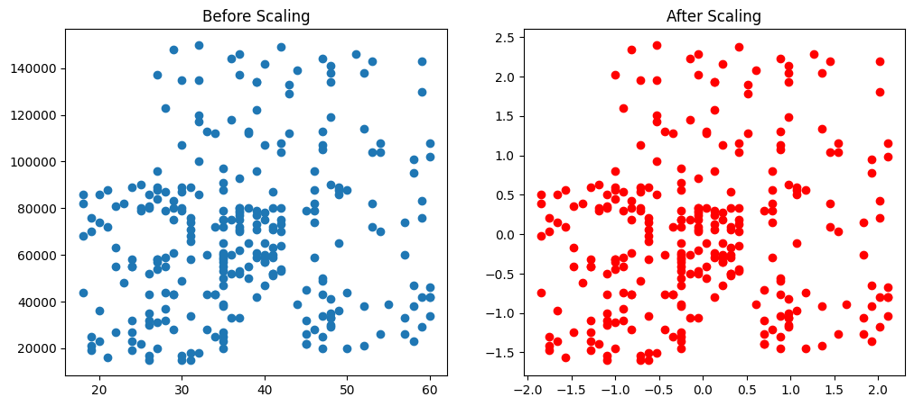
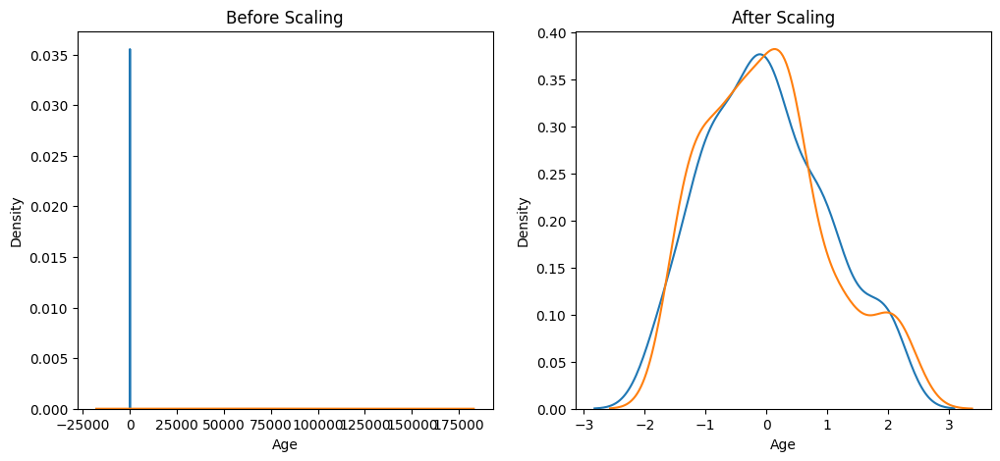

# Feature Scaling Techniques

This repository contains a Jupyter Notebook that demonstrates and compares different feature scaling techniques used in preprocessing data for machine learning models.

## Contents

* StandardScaler
* Comparison of Scaled Outputs
* Visualization of Effects of Scaling

## Usage

To run the notebook:

```bash
pip install -r requirements.txt  # install dependencies (e.g., numpy, pandas, matplotlib, scikit-learn)
jupyter notebook feature_scaling.ipynb
```

## Images





## Preview

```python
import pandas as pd
import numpy as np
import matplotlib.pyplot as plt
import seaborn as sns
from sklearn.preprocessing import StandardScaler
```

## Dataset

The dataset consists of numerical features suitable for scaling, likely to represent real-world attributes where relative magnitudes matter.

## Description

This notebook focuses on the application and visualization of `StandardScaler`, a common technique in machine learning preprocessing. Using visual plots, the notebook illustrates how scaling transforms data distributions, and emphasizes the impact on models sensitive to feature magnitudes.

## Findings

The notebook highlights the differences between scaling methods and suggests when to use each.

## License

This project is licensed under the MIT License.
